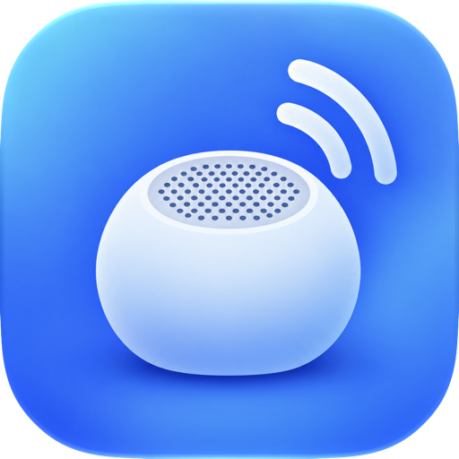

<p align="center">
  
</p>

<h1 align="center">Relay</h1>

<p align="center">
  A macOS menu bar app that passes one Bluetooth speaker between all your Macs — in one click.
</p>

<p align="center">
  
  
  
</p>

---

## Overview

Many Bluetooth speakers and headphones only accept one connection at a time, with no multipoint. Whichever Mac grabbed the speaker last keeps it, and the others can't connect until you go and disconnect it by hand.

Relay fixes that. Install it on each of your Macs, pair them once, and the menu bar icon becomes a switch: pick the Mac that should play, and every other Mac lets go of the speaker on its own. Choose **Aucun Mac** (No Mac) and they all step aside so your iPhone can use it.

No Terminal, no Homebrew, no SSH, no server. The Macs talk to each other directly on your local network.

## Features

**In the menu bar**

- **Left click** opens a plain, native menu: one entry per Mac with its own icon and name, a checkmark on the one that has the speaker, and **Aucun Mac** (No Mac) to free it for the iPhone. Offline Macs are greyed out.
- **Right click** moves the speaker to the next device: each Mac in turn, then the iPhone, then around again.
- The icon shows who has the speaker (the icon of that Mac, an iPhone, or a muted speaker). Three dots hop while a switch is running, and a warning sign appears if something went wrong. The menu then says what happened in plain words.
- Any Mac can send the speaker to any other: from the Mac mini, you can hand it to the MacBook.

- **When media starts here** — If a video or a track starts on this Mac while the speaker is on another one, a small panel offers to bring it over. One click and it moves. It never fires for alerts, notifications or short interface sounds, nor when you are listening on headphones. **Pas maintenant** (Not now) mutes it for 30 minutes, and any switch of the speaker lifts that pause.

**Around it**

- **Setup assistant** — Bluetooth permission, speaker choice, this Mac's name and icon, pairing with your other Macs, launch at login, and a live test.
- **Aide et prérequis** (Help & requirements) — A live checklist (Bluetooth, speaker paired here, local network, other Macs reachable, launch at login) with a one-click fix for each failing item. It also has troubleshooting guides and a **Copier les logs** (Copy logs) button.
- **Settings** — Name and icon of this Mac, the Macs in your group with their online status, the speaker, launch at login, and an option to release the speaker when this Mac goes to sleep.
- Any Bluetooth speaker or headset, any number of Macs.
- Light and dark mode, and *Reduce Motion* is respected everywhere.

## How it works

### Switching

When you pick a Mac, the Mac you clicked on runs the switch:

1. It tells every other online Mac to **release** the speaker, and releases it itself if it isn't the target.
2. It waits for their acknowledgements (5 s at most).
3. It **connects** the target: locally, or by asking the target Mac to do it.
4. Every Mac broadcasts its state, so all the menus update at once.

Connecting opens the Bluetooth link (three attempts, one second apart), then makes the speaker the default audio output through CoreAudio if macOS didn't do it on its own.

### Lock mode

macOS reconnects known audio devices by itself, which is exactly what keeps a speaker stuck to the wrong Mac. So a Mac that was asked to release the speaker becomes **locked**. It listens for Bluetooth connections, and if the speaker comes back without being asked, it disconnects it immediately. The lock is lifted as soon as that Mac is chosen again.

### Noticing playback

CoreAudio reports when the default output device starts and stops running, and Relay subscribes to that: nothing is polled, nothing runs while nothing plays. A run has to last five seconds to count, which is what separates a video from a notification sound. The app behind the sound is then looked up in CoreAudio's per-process list (macOS 14.2+) to name it in the offer.

### Network protocol

Each Mac advertises a Bonjour service (`_speakerswitch._tcp`) carrying its ID, name and icon. Messages are JSON over TCP with a 4-byte length prefix:

```
[4-byte big-endian length] + {"message": <JSON>, "mac": <HMAC-SHA256>}
```

Every command is signed with a group key kept in the Keychain. Commands also carry a timestamp and a nonce, so an old or replayed message is rejected. Macs send each other a heartbeat and reconnect on their own when a peer reappears.

### Pairing

Pairing works like pairing a keyboard: one Mac shows a 6-digit code and the other one types it.

1. The two Macs exchange Curve25519 keys.
2. The code is confirmed one digit at a time. Each Mac commits to the digit before revealing anything, so a device in the middle would have to guess all six digits blind, and a single wrong guess cancels the code.
3. The group key, the list of Macs and the speaker are then sent encrypted (ChaChaPoly).

A Mac that joins an existing group gets everything it needs in one go.

## Requirements

- macOS 14 Sonoma or later
- Xcode 26 or later to build (the app icon uses the Icon Composer `.icon` format)
- The speaker must be paired **once** with each Mac, in System Settings › Bluetooth. Relay handles the connections after that.
- All Macs on the same local network

### Permissions

| Permission | Why |
| --- | --- |
| Bluetooth | To connect and disconnect the speaker |
| Local network | To find your other Macs and talk to them |
| Login items | To start with your session (optional, on by default) |

Relay runs in the App Sandbox with only `device.bluetooth`, `network.client` and `network.server`.

## Installation

1. Download the latest release from [Releases](https://github.com/AMSTAGU/Relay/releases)
2. Move `Relay.app` to your Applications folder, on **each** Mac
3. Launch it and follow the setup assistant
4. On your second Mac, click **Appairer** (Pair) next to the first one and type the code it shows

## Building from source

```sh
git clone https://github.com/AMSTAGU/Relay.git
cd Relay
open Relay.xcodeproj
```

Select the **Relay** scheme and press <kbd>⌘</kbd> <kbd>R</kbd>. You may need to pick your own development team under **Signing & Capabilities** first.

### Tests

```sh
Scripts/selftest.sh             # message signing, replay protection, pairing (right and wrong code)
Scripts/selftest.sh --group     # + two real instances talking over Bonjour
Scripts/selftest.sh --playback  # the playback detector (threshold, restart, real sound)
Scripts/selftest.sh --idle 60   # CPU time and wakeups of two idle instances
```

The `--group` run starts two isolated instances in one process. It covers discovery, pairing, heartbeat, name and speaker sync, a remote connect order, the lock and removing a Mac. It uses a fake speaker address, so no real device is touched.

### Release

```sh
xcrun notarytool store-credentials relay-notary --apple-id <apple-id> --team-id <team-id>   # once
Scripts/release.sh
```

This archives the app, signs it with Developer ID, notarizes and staples it, and zips it.

## Project structure

```
Relay/
├── App/
│   ├── Main.swift                 Entry point (menu bar agent, no Dock icon)
│   ├── AppDelegate.swift          Wiring, main menu for text editing shortcuts
│   └── WindowManager.swift        Onboarding, settings, help and pairing windows
├── Speaker/
│   ├── SpeakerController.swift    IOBluetooth: paired devices, connect, disconnect, notifications
│   └── AudioOutput.swift          CoreAudio: find the speaker and make it the default output
├── Network/
│   ├── PeerService.swift          Bonjour, links to the other Macs, requests, heartbeat
│   ├── Wire.swift                 Message format, framing, HMAC signing, replay protection
│   ├── FramedConnection.swift     Length-prefixed TCP connection
│   └── Pairing.swift              Code pairing (Curve25519 + per-digit commitments)
├── Coordinator/
│   └── SwitchCoordinator.swift    Switch state machine, lock mode, group sync
├── Core/
│   ├── Store.swift                Settings (Codable in UserDefaults), group key in the Keychain
│   └── Permissions.swift          Bluetooth, login item, System Settings shortcuts
├── UI/
│   ├── StatusItemController.swift Menu bar icon and native menu
│   ├── Design/                    Buttons, switch, cards, code field, colours and type
│   └── Onboarding/ Help/ Settings/ Shared/
└── AppIcon.icon                   App icon (Icon Composer)
```

## Privacy

Relay never talks to a server. Everything stays between your Macs on your local network, and every message is authenticated with a key that only your Macs know. No analytics, no telemetry.

## Notes

- The interface is currently in French.
- A corporate VPN, a firewall or a guest Wi-Fi can keep Macs from seeing each other: they then show as offline. The **Aide et prérequis** window explains how to check.
- The protocol has nothing Mac-specific, so an iPhone companion app could use it too.
